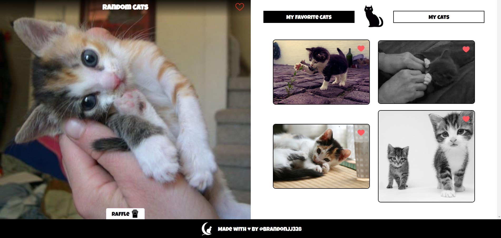

# MoonCat

MoonCat es una aplicación que te muestra fotos de gatitos aleatoriamente. Esta aplicación te permite guardar algunas de estas imágenes como favoritos y subir fotos de tus gatitos.

## Tabla de contenido

- [MoonCat](#mooncat)
  - [Tabla de contenido](#tabla-de-contenido)
  - [Screenshot de la aplicación](#screenshot-de-la-aplicación)
    - [Links](#links)
    - [Usage](#usage)
  - [El proceso](#el-proceso)
    - [Build with](#build-with)
    - [What I learned](#what-i-learned)
  - [Author](#author)
## Screenshot de la aplicación

### Links

- [Live Site URL](https://brandon328.github.io/curso-API-REST-JS/)

### Usage
1. Clona este repositorio en un entorno local.
2. Abrir el archivo index.html que se encuentra dentro de la ruta `src/index.html`.

## El proceso

### Build with

- HTML5 semántico
- CSS 
- Flexbox
- CSS Grid
- JS Asíncrono
- Mobile-first workflow
- NPM - Gestor de paquetes
- [Git y Github](https://github.com/) - Control de versiones
- [TheCatAPI](https://thecatapi.com/)

### What I learned

Aprendí a usar funciones asíncronas en JavaScript y a como realizar peticiones de tipo GET y POST a una API.

## Author

- Website - [Brandon James Huaman](https://www.brandonjj.com)
- Frontend Mentor - [@Brandon328](https://www.frontendmentor.io/profile/Brandon328)
- Twitter - [@BrandonJJ328](https://www.twitter.com/BrandonJJ328)
- Linkedin - [@BrandonJJ](https://www.linkedin.com/in/brandonjj/)
- Github - [@Brandon328](https://github.com/Brandon328)
